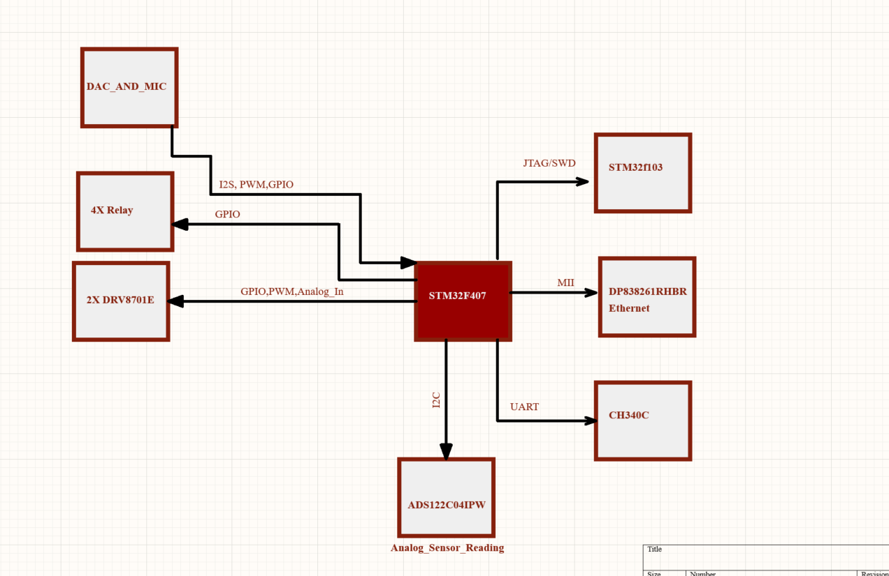
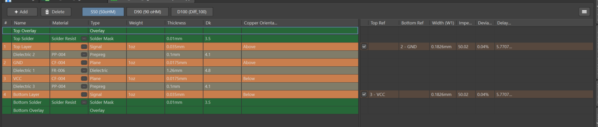
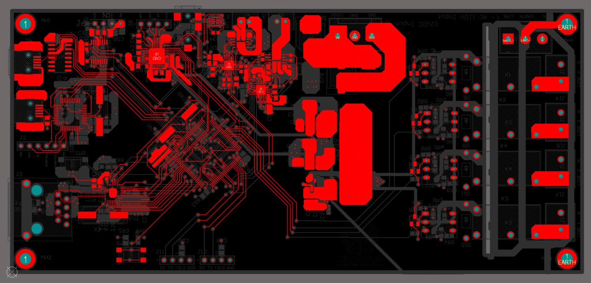
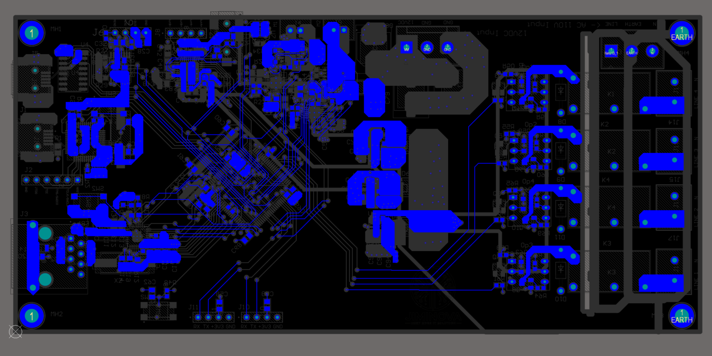
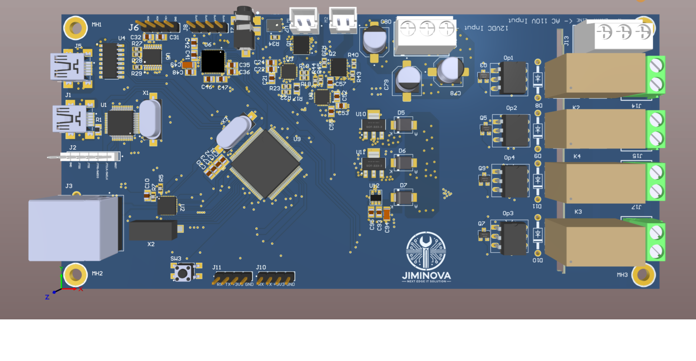
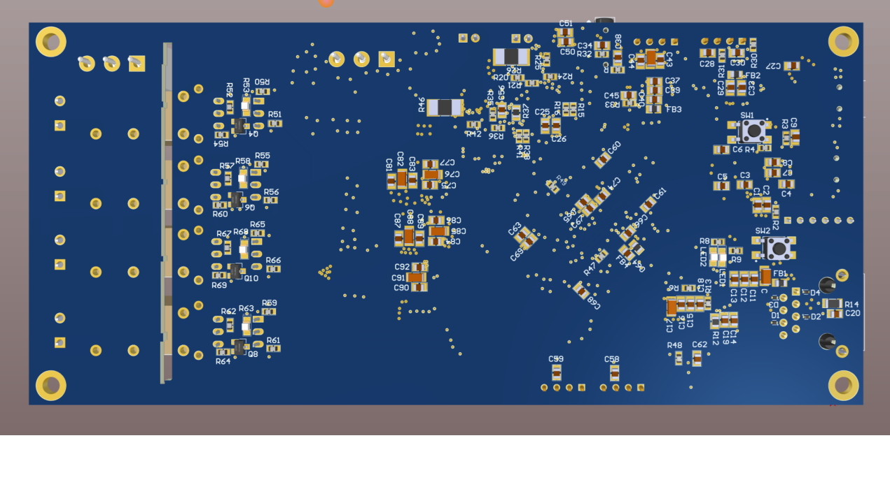

# Mixed_Signal_PCB

# 🧠 Home Automation Controller Board

A central controller board designed to automate various home systems — combining relay control, motor driving, high-resolution sensor data acquisition, and robust communication interfaces — all with protection circuitry for real-world reliability.

---

## 🚀 Project Description

Design a **central controller board** for automating a variety of home systems.  
The board integrates:

- Control of **high-voltage AC appliances** via relays
- **DC motor driving**
- **Sensor data acquisition**
- Audio I/O
- Multiple **communication protocols**
- Full **circuit protection** features for reliability and safety

---

## 📐 System Features

### 🔌 Power & Control

- **4x Single-Channel Relay Modules**  
  → For 110V AC lighting and appliances

- **2x 12V DC Motors (3A)**  
  → Controlled via **DRV8701** motor drivers

- **24-bit ADC – ADS122C04IPW**  
  → High-resolution analog-to-digital sensor reading

---

### 🔗 Communication Interfaces

- 🖧 **Ethernet** – Up to **2 MB/s**  
- 🔌 **USB 2.0**  
- 🚐 **CAN Bus** – Up to **1 MB/s**  
- 📡 **Multiple UARTs**

---

### 🔊 Audio I/O

- 🎤 **Microphone**
- 🔈 **Speaker**
- Via **Audio Codec + I2C DAC**

---

### 🛡️ Circuit Protection

- ⚡ **TVS/ESD Protection Diodes**
- 🔁 **Negative Polarity Protection**
- 🔌 **Opto-isolation** between:
  - High-voltage AC systems
  - Low-voltage DC systems

---

## 📲 System Functionality

The controller board will:

- ✅ **Gather data** from connected sensors
- ✅ **Control high-power devices** such as lights, appliances, and motors
- ✅ **Communicate with mobile and cloud platforms** for remote monitoring and control

---

## 🧰 Possible Applications

- Smart Home Control Systems
- Remote Sensor and Appliance Management
- Voice-Controlled Home Automation
- Energy Monitoring and Automation Hubs

---

##Project Structure

  

---

---

##Layer Stack up

  

---

---

##2D View: Top and  Bottom

  

  

---
##3D View: Top and  Bottom

  

  

---
